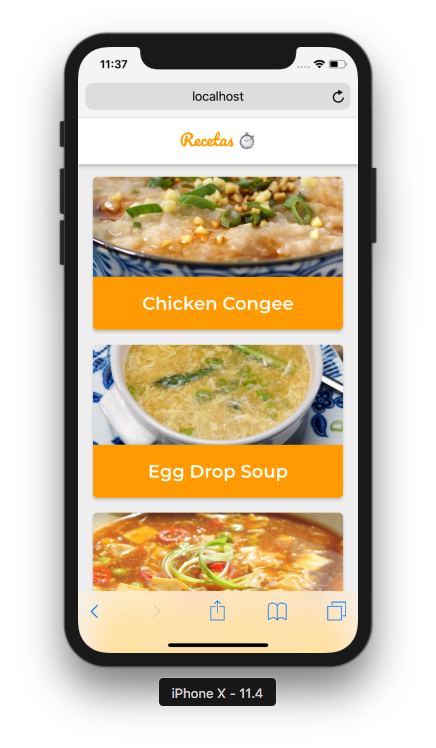

# Recetas

### 🕹 DEMO: https://efrensanchez.github.io/recetas/

PWA using MealDB's API to display recipes with their instructions. Some features:

* Offline Support with Workbox.
* Network strategies for each resource.
* Add to Home Screen.

## Scripts

* `npm install` to install the dependencies.
* `npm run dev` to development environment
* `npm run build && npm start` production.

## 🏗️ Built With

- [React](https://reactjs.org/docs/getting-started.html) - The web framework used

## 🖋️ Author

- **Efren Sanchez** - *Initial work* - [EfrenSanchez](https://github.com/EfrenSanchez)

## ©️ License

This project is licensed under the MIT License 
